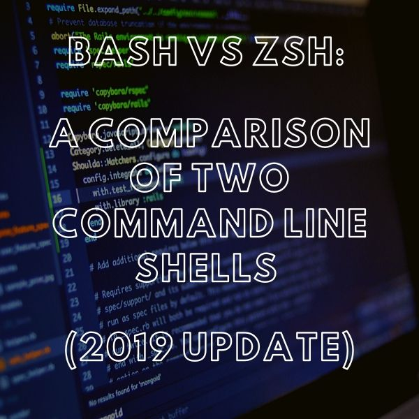
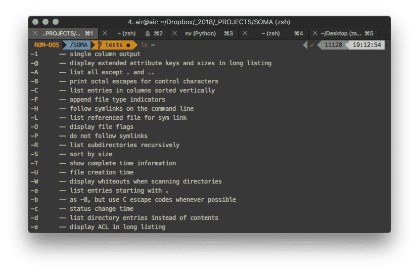

# Bash和zsh

[toc]

## Bash和zsh的历史

1971年，Unix操作系统的第一个版本以Thompson shell作为其默认shell。 尽管缺少脚本功能，但第一个外壳程序为输入/输出重定向建立了许多标准。 随着7年版本1979 Unix的发布，新操作系统以Bourne shell作为其默认shell发行了。

### 制作重击

1989年下半年，Brian Fox为GNU项目创建了Bash shell， [可行的软件替代品](https://sunlightmedia.org/zh-CN/服务/软件开发/) 为伯恩贝壳。 Bash对其前身进行了重大改进。 这些改进中最突出的是它作为脚本语言的功能。bash的用户可以编写自己的程序来自动执行任务。

这些“ shell”脚本可通过键入文件名（通常以.sh扩展名）执行。 在大多数情况下，bash可以支持Bourne和C shell的大多数功能，此外还可以提供自己独特的功能，包括命令行编辑和整数计算。

### 创建zsh

Bash出现后不久，普林斯顿大学的一名学生创建了Z shell或“ zsh”。 与该操作外壳并驾齐驱的是一个基于社区的在线平台，称为Oh My Zsh，它具有主要扩展功能，例如zsh的插件和主题。 截至2019年XNUMX月，macOS Catalina宣布他们将采用zsh作为其默认shell替代bash，这是zsh发烧友的主要“胜利”。

## Bash vs zsh：bash和zsh之间的共同特征

在大多数情况下，bash vs zsh共享许多便利的功能，这些功能均被视为高效的shell。

### **z命令**

两者共享的一项非常有用的功能是 `z` 命令，使开发人员实质上可以跟踪其目录。 随着 `z` 命令，只需输入z，然后输入目录名称，就可以导航到经常访问/最近访问的目录。 例如，假设您有一个目录 `newProject` 位于 `~/src/2018/projects/newProject`。 使用此工具，您只需键入 `z newProject`.

### **自动完成**

这两个外壳程序的另一个实用方面是它们的选项卡自动完成功能。 在每个shell中，您只需键入命令，然后输入 `-`，然后点击标签。 然后，此操作将立即显示该命令的所有可用选项。 然后，您可以在可用选项之间进行制表，直到找到所需的选项为止。 这两个外壳程序都为它们的命令行自动完成功能提供了灵活性和自定义功能。

### **自动改正**

此外，还有一个有用的实用程序 [网页设计公司](https://sunlightmedia.org/zh-CN/) 在两个外壳中，大多数情况下都是自动校正。 例如，在Z shell中，如果在写入文件位置时进行了无误的错字，则内置了拼写校正功能，它将自动检测错字。 虽然这不是bash的自定义设置，但您可以使用shopt命令轻松进行必要的调整以允许自动更正 `cdspell` 和 `dirspell`.

### **颜色定制**

即使在外观和组织方面，两个外壳都可以很好地完成任务。 `zsh` 通过在目录中添加突出显示颜色来区分两者。 此外，字体粗细会稍大一些。 这对于查看什么是文件和什么目录非常有帮助。 使用的确切颜色将取决于您的终端颜色设置。 另一方面，bash用户还可以通过调整界面来反映其视觉需求。 `LS_colors` 变量。

虽然这些只是这两个Shell提供的各种工具中的一部分，但它们提供了有关bash和 `zsh` 承认彼此相似。 但是，它们两者都有一些区别，可以在开发人员之间形成相对于另一个的偏好。

# Bash vs Zsh：两个命令行Shell的比较（2019更新）

By [李晶](https://sunlightmedia.org/zh-CN/作者/水晶/) 20年2019月XNUMX日 [36条评论](https://sunlightmedia.org/zh-CN/bash-vs-zsh/#comments)

如果您曾经在* nix系统（基于Unix或类似Unix）上使用过命令行，则很可能已经使用了bash shell。 bash（“ Bourne-again shell”的缩写）是许多类Unix操作系统的默认shell。

类似Unix的操作系统的常见示例包括GNU / Linux和macOS。 尽管终端还有许多其他外壳，但是最受欢迎的外壳之一是 `zsh`，或“ Z shell”。

虽然bash和zsh都是强大的Shell，并且具有许多突出的功能，但它们也具有用户可能会有不同偏好的区别。 这篇文章将概述bash与zsh的功能和比较，如何将其设置为默认shell，以及一些配置建议。

## bash和zsh的简短历史

1971年，Unix操作系统的第一个版本以Thompson shell作为其默认shell。 尽管缺少脚本功能，但第一个外壳程序为输入/输出重定向建立了许多标准。 随着7年版本1979 Unix的发布，新操作系统以Bourne shell作为其默认shell发行了。

### **制作重击**

1989年下半年，Brian Fox为GNU项目创建了Bash shell， [可行的软件替代品](https://sunlightmedia.org/zh-CN/服务/软件开发/) 为伯恩贝壳。 Bash对其前身进行了重大改进。 这些改进中最突出的是它作为脚本语言的功能。bash的用户可以编写自己的程序来自动执行任务。

这些“ shell”脚本可通过键入文件名（通常以.sh扩展名）执行。 在大多数情况下，bash可以支持Bourne和C shell的大多数功能，此外还可以提供自己独特的功能，包括命令行编辑和整数计算。

### **创建zsh**

Bash出现后不久，普林斯顿大学的一名学生创建了Z shell或“ zsh”。 与该操作外壳并驾齐驱的是一个基于社区的在线平台，称为Oh My Zsh，它具有主要扩展功能，例如zsh的插件和主题。 截至2019年XNUMX月，macOS Catalina宣布他们将采用zsh作为其默认shell替代bash，这是zsh发烧友的主要“胜利”。

## Bash vs zsh：bash和zsh之间的共同特征

在大多数情况下，bash vs zsh共享许多便利的功能，这些功能均被视为高效的shell。

### **z命令**

两者共享的一项非常有用的功能是 `z` 命令，使开发人员实质上可以跟踪其目录。 随着 `z` 命令，只需输入z，然后输入目录名称，就可以导航到经常访问/最近访问的目录。 例如，假设您有一个目录 `newProject` 位于 `~/src/2018/projects/newProject`。 使用此工具，您只需键入 `z newProject`.

### **自动完成**

这两个外壳程序的另一个实用方面是它们的选项卡自动完成功能。 在每个shell中，您只需键入命令，然后输入 `-`，然后点击标签。 然后，此操作将立即显示该命令的所有可用选项。 然后，您可以在可用选项之间进行制表，直到找到所需的选项为止。 这两个外壳程序都为它们的命令行自动完成功能提供了灵活性和自定义功能。

### **自动改正**

此外，还有一个有用的实用程序 [网页设计公司](https://sunlightmedia.org/zh-CN/) 在两个外壳中，大多数情况下都是自动校正。 例如，在Z shell中，如果在写入文件位置时进行了无误的错字，则内置了拼写校正功能，它将自动检测错字。 虽然这不是bash的自定义设置，但您可以使用shopt命令轻松进行必要的调整以允许自动更正 `cdspell` 和 `dirspell`.

### **颜色定制**

即使在外观和组织方面，两个外壳都可以很好地完成任务。 `zsh` 通过在目录中添加突出显示颜色来区分两者。 此外，字体粗细会稍大一些。 这对于查看什么是文件和什么目录非常有帮助。 使用的确切颜色将取决于您的终端颜色设置。 另一方面，bash用户还可以通过调整界面来反映其视觉需求。 `LS_colors` 变量。

虽然这些只是这两个Shell提供的各种工具中的一部分，但它们提供了有关bash和 `zsh` 承认彼此相似。 但是，它们两者都有一些区别，可以在开发人员之间形成相对于另一个的偏好。

 

## Bash vs zsh：考虑在shell之间切换的原因

bash vs zsh的命令和整体交互本质上是相同的。 一个外壳的知识和熟悉程度可以轻松地转化为另一个外壳，而无需面对陡峭的学习曲线。 但是，这两个外壳程序确实共享其独特的功能，这可能会促使开发人员声明明确的偏好。

首先， `zsh` 拥有强大的在线社区 [哦，我的Zsh](https://ohmyz.sh/)。 噢，我的ZSH是最古老，最受欢迎的管理方式之一 `zsh` 配置。 Oh My ZSH提供了社区提供的250多个插件和140个不同的主题，是自定义z shell（甚至附带自动更新功能的自定义z外壳）的绝佳起点。 这使用户可以在具有更个性化界面的外壳中工作，并通过 [各种各样的工具](https://sunlightmedia.org/zh-CN/适用于所有代理商的10种最佳营销工具/)，并可以使用方便的现成支持系统。 例如，界面的一个非常有利的选择是在输入长文件路径或命令时自动隐藏的右手侧提示或侧提示。 即使是这种微小的灵活性也使开发人员转向 `zsh`.

另一方面，Bash具有一组令人印象深刻的编程功能，例如循环和条件构造，波浪号和括号扩展以及别名的使用。 它还有一些类似的问题，例如功能强大的调用工具，被设置为受限的shell模式，具有特定的POSIX模式等等。 由于Bash也是一个较旧且成熟的Shell，因此该软件也有无穷的在线资源。