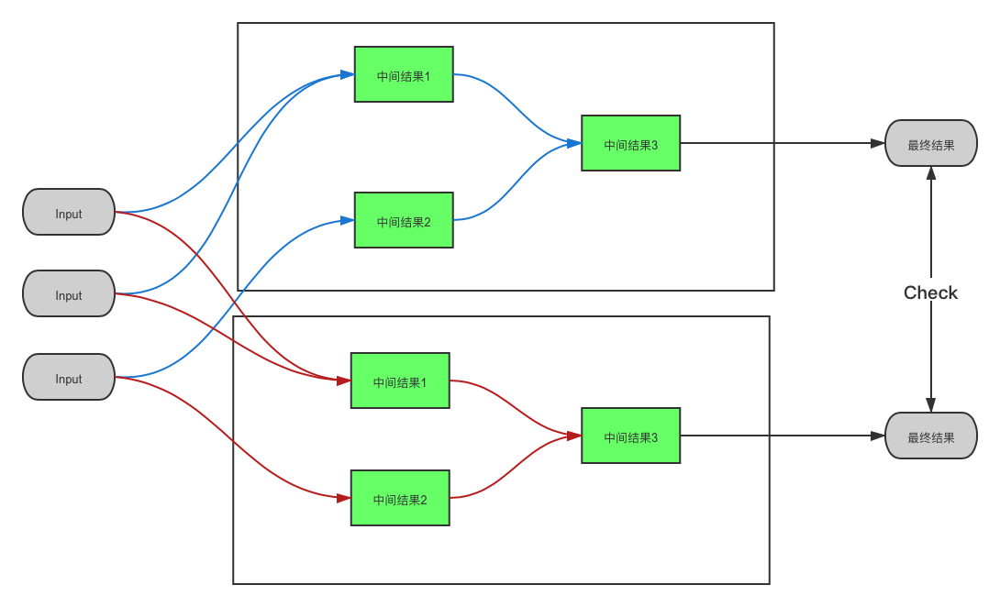
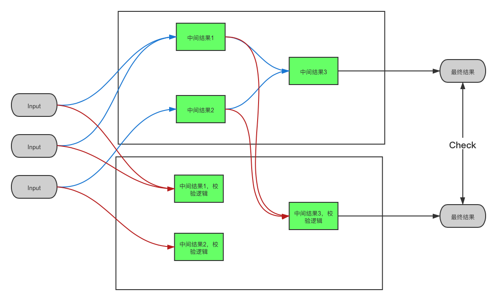

[toc]

# 1、测试用例

### 1.1 测试用例有什么作用？

* 评估测试用时
* 衡量测试覆盖度
* 方便整理测试准备数据
* 方便把控测试进度
* 方便把握测试重点
* 进行测试工作迭代

### 1.2 测试用例生命周期？

1、用例产出：

* 用例设计
* 用例编写

2、用例使用

* 使用策略

3、用例维护

* 维护方法
* 维护工具

### 1.3 怎样是一个合格的测试用例？

1. 能够验证需求功能的正确性。
2. 能够保证测试覆盖的完整性。
3. 用例的可执行性。
4. 测试结果的可判断性。

### 1.4 怎样是一个优秀的测试用例？

1. 用例的冗余度低。用例重复验证的部分少。
2. 用例的可执行性高。例如同样是验证一个查找数据的接口，通过登陆客户端在测试环境查找数据执行起来就比较复杂。直接通过代码发起接口调用来验证接口功能执行比较方便。

### 1.5 用例组成的基础项有哪些？

1. 用例标题
2. 前置条件
3. 操作步骤
4. 预期结果
5. 优先级

# 2、业务旁路校验监控

| 新旧对比                                                     | 流程图                                                       |
| ------------------------------------------------------------ | ------------------------------------------------------------ |
| 原业务旁路校验监控逻辑，存在的问题： * 正确性难保证。 \* 误告警多，漏告警多。 * 维护成本高。 |  |
| 现业务旁路校验监控逻辑： * 每个监控规则相互独立         |  |

