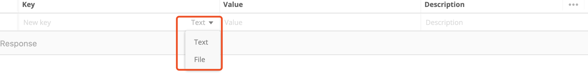

# Postman

[toc]

## POSTMAN 使用（归档入开发-postman）

在游戏内购的创建下单和退款数据的时候，我们之前使用的时候想接口发送HTTP请求的方式。使用的工具是POSTMAN。这里整理一下POSTMAN的使用技巧。上接：开发 -- postman 文档

首先我们来看HTTP请求报文的结构

### GET请求：

1、首先是选择HTTP方法 GET

2、输入请求的URL

3、URL右侧的 Params，可以输入URL里面的参数。之前我在这块弄错了，以为这个是输入请求BODY的地方（GET 方法没有请求BODY，POST方法有）

4、选择授权模式，默认是不进行授权。

5、输入报文头，默认是没有内容

6、GET方法没有请求体

7、Pre-request Script：预请求脚本，在请求之前执行的脚本，默认为空。

在这些栏目中填入相应的内容，然后点击 send 就能发送一个GET请求了。

### POST请求：

在软件中我们只需要将请求方法换成POST就能够使用POST。

其余的配置和GET方法都是一样的，我们重点关心POST方法中添加请求BODY的方式。

1、form-data：格式化数据。通过这种方式我们可以通过键值对的方式在添加请求体。其中可以是文本（text），也可以是文件（file）。这个方式也是最常见的方式。

2、x-www-form-urlencoded：同样也是正常的键值对传参。

3、Raw：通过传入一个JSON来传递参数。

4、在Raw中输入一个 xml， 我们就能使用xml的形式传参数。这种方式用的比较少

5、Binary：传入二进制数据